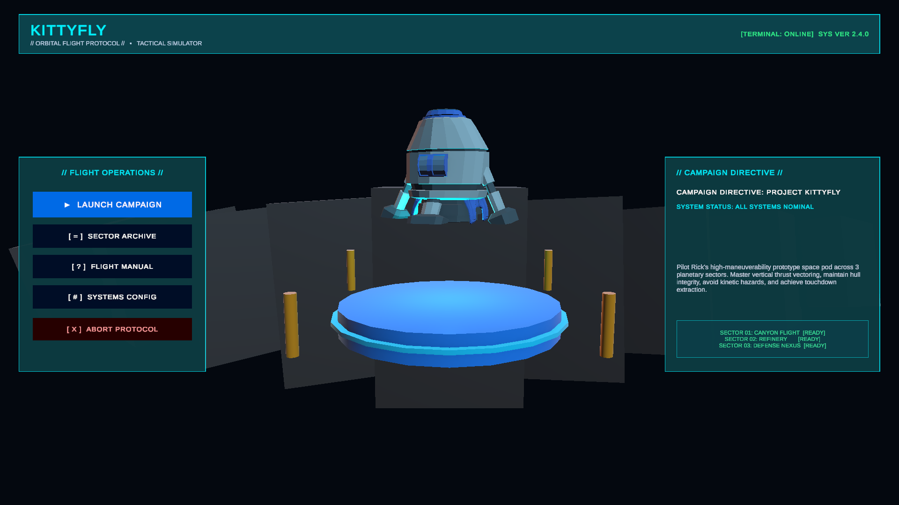
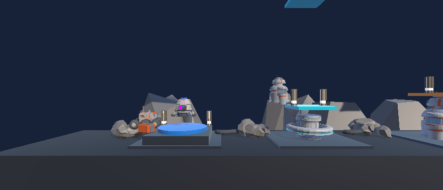
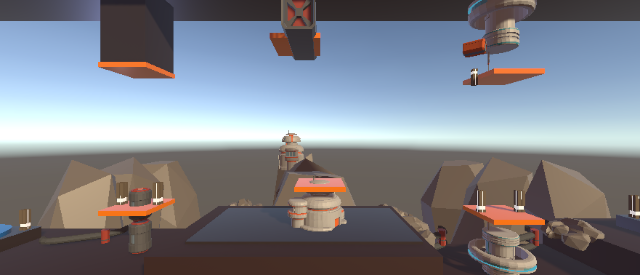
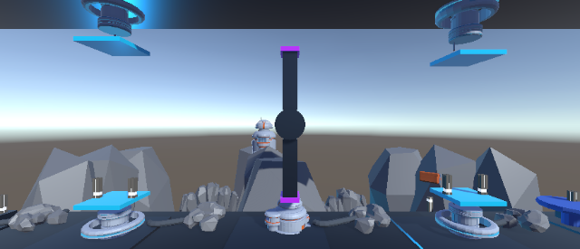
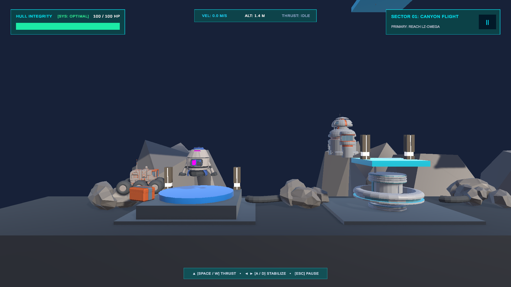

# 🚀 KittyFly: Odyssey Beyond Orbit

[](https://unity.com/)
[](https://unity.com/features/universal-render-pipeline)
[](https://docs.unity3d.com/Packages/com.unity.inputsystem@1.20/manual/index.html)
[]()
[]()
[](LICENSE)

> **A 2.5D Precision Newtonian Physics Spacecraft Simulator featuring cybernetic HUD telemetry, multi-stage hazard navigation, and cinematic particle visual effects.**

---

## 📸 Visual Showcase

<div align="center">
  
  <p><em>Interactive 3D Sci-Fi Main Menu featuring real-time ship idle physics & cyberdeck navigation.</em></p>
</div>

### 🎮 In-Flight Telemetry & Hazard Navigation

| Sector 01: Canyon Flight | Sector 02: Kinematic Refinery Crane |
| :---: | :---: |
|  |  |
| *Atmospheric canyon ingress with glowing transit gates* | *Heavy industrial cargo crane oscillating across flight path* |

| Sector 03: 360° Rotating Plasma Turbine | Diegetic Cockpit HUD & Telemetry |
| :---: | :---: |
|  |  |
| *High-speed quad-blade turbine in orbital defense shaft* | *Real-time speed, altitude, burn gauge, and segmented health* |

---

## 🌟 Key Features

### 🛸 1. Precision Newtonian Flight Mechanics
- **True Inertial Physics**: Built with Unity's 2.5D `Rigidbody` physics ($Z$-plane locked, $X/Y$ tilt constraints).
- **Zero-Drag Space Dynamics**: No artificial friction—every acceleration burst requires an opposing counter-burn to arrest momentum.
- **Directional RCS Thrusters**: Dedicated left and right Reaction Control System (RCS) thrusters visually fire whenever applying roll torque.
- **Unified Input Pipeline**: Supports the modern Unity Input System (`InputAction`) with seamless fallback to standard keyboard inputs.

### ⚡ 2. Multi-Layered Thruster VFX & Dynamic Lighting
- **Core Ion Plume**: High-velocity tapered plasma plume with custom particle size curves.
- **Cyan Silhouette Cone**: Vibrant `#00F0FF` volumetric outer flame envelope for high sci-fi readability.
- **Radiant Embers**: Amber/gold micro-particles scattering with gravity-assisted drift.
- **Dynamic Terrain Illumination**: Synchronized real-time point light that dynamically bathes canyon walls and landing pads during burns.

### 🖥️ 3. Cyberpunk Diegetic Cockpit HUD
- **Live Telemetry Engine**: Computes and displays velocity ($m/s$), elevation, and active thruster burn rate in real time.
- **Color-Shifting Hull Integrity**: Segmented 100 HP health system that shifts dynamically:
  - `Cyber-Cyan`: 100% – 60% HP
  - `Warning Amber`: 59% – 30% HP
  - `Critical Crimson`: < 30% HP
- **Holographic Damage Vignette**: Dynamic screen-space vignette flashes crimson upon hull collisions, scaling with damage intensity.
- **Interactive Modals**: Contextual in-game Pause Menu, Mission Victory Briefing, and Crash Failure terminals.

### 🌐 4. Interactive 3D Cyberdeck Main Menu
- **Physical 3D Diorama**: Real-time floating spacecraft with subtle idle hover physics (`MenuHoverShip.cs`).
- **Sector Select Archive**: Direct mission jump console with threat level ratings and mission specs.
- **Diegetic Pilot Manual**: In-game flight handbook detailing thruster handling, hazard intelligence, and emergency controls.
- **System Calibration**: Master volume slider with `PlayerPrefs` persistence and display toggle.

---

## 🗺️ Campaign Sectors

```
               [ MAIN MENU (Diorama Stage) ]
                             │
                             ▼
              [ SECTOR 01: CANYON FLIGHT ]
         (Atmospheric Ingress & Transit Gates)
                             │
                             ▼
            [ SECTOR 02: INDUSTRIAL REFINERY ]
        (Asymmetric Caverns & Moving Cargo Crane)
                             │
                             ▼
         [ SECTOR 03: ORBITAL DEFENSE NEXUS ]
     (Counter-Cycle Pistons & 360° Rotating Turbine)
                             │
                             ▼
               [ MISSION VICTORY DEBRIEF ]
```

### 🔹 Sector 01: Canyon Flight
- **Theme**: High-altitude atmospheric rift at twilight.
- **Objective**: Master basic pitch stabilization, altitude hover balance, and soft-landing vector alignment.
- **Key Features**: Twin illuminated cyber-arch navigation gates directing transit lanes.

### 🔹 Sector 02: Industrial Refinery
- **Theme**: Subterranean industrial extraction facility.
- **Objective**: Navigate tight overhead clearances while evading continuous mechanical hazards.
- **Key Features**: Heavy oscillating cargo crane (`Mathf.Sin` motion) and strategic **Nano-Repair Pickups** (+25 HP).

### 🔹 Sector 03: Orbital Defense Nexus
- **Theme**: High-security orbital launch silo.
- **Objective**: The ultimate test of pilot dexterity and timing.
- **Key Features**: Synchronized vertical hydraulic crushers, followed by a continuous high-speed 360° rotating quad-blade plasma turbine guarding the final landing pad.

---

## 🕹️ Controls & Keybindings

### 🚀 Flight Controls

| Action | Primary Key | Secondary / Arrow | Gamepad |
| :--- | :---: | :---: | :---: |
| **Main Thruster (Ascend / Accelerate)** | <kbd>Space</kbd> | <kbd>W</kbd> / <kbd>↑</kbd> | `South` / `Right Trigger` |
| **Rotate Counter-Clockwise (Roll Left)** | <kbd>A</kbd> | <kbd>←</kbd> | `Left Stick Left` / `D-Pad Left` |
| **Rotate Clockwise (Roll Right)** | <kbd>D</kbd> | <kbd>→</kbd> | `Left Stick Right` / `D-Pad Right` |
| **Pause / Tactical Menu** | <kbd>Esc</kbd> | <kbd>P</kbd> | `Start` |

### 🛠️ Flight Director Cheats (Debug Keys)

| Key | Function |
| :---: | :--- |
| <kbd>L</kbd> | **Skip to Next Sector** (Instantly triggers sector warp) |
| <kbd>C</kbd> | **Godmode / Collision Override** (Toggles terrain & obstacle damage) |

---

## 🏗️ Technical Architecture

### 📂 Repository Structure

```
KittyFly/
├── Assets/
│   ├── Scenes/
│   │   ├── MainMenu.unity            # 3D interactive diorama menu
│   │   ├── Level1.unity              # Sector 01: Canyon Flight
│   │   ├── Level2.unity              # Sector 02: Industrial Refinery
│   │   ├── Level3.unity              # Sector 03: Orbital Defense Nexus
│   │   └── sandbox.unity             # Physics & VFX test bench
│   ├── Scripts/
│   │   ├── Movement.cs               # Newtonian thrust & RCS torque controller
│   │   ├── CollisionHandler.cs       # Collision matrix, damage & level routing
│   │   ├── RocketHealth.cs           # Hull durability, invulnerability & healing
│   │   ├── HealthPickup.cs           # Nano-repair cache trigger & particle FX
│   │   ├── Oscillator.cs             # Sinusoidal motion engine for moving hazards
│   │   ├── Rotator.cs                # Continuous angular velocity for turbines
│   │   ├── GameUI.cs                 # Cockpit HUD, telemetry & modal controllers
│   │   ├── MainMenuUI.cs             # Cyberdeck terminal UI & settings manager
│   │   └── MenuHoverShip.cs          # Diorama idle levitation & physics bobbing
│   ├── Screenshots/                  # HD gameplay captures & promotional stills
│   ├── Settings/                     # URP render assets & pipeline profiles
│   └── InputSystem_Actions.inputactions # Input system action mappings
├── ProjectSettings/                  # Unity engine configuration & version tags
└── Packages/                         # Unity package manager dependencies
```

### ⚙️ Core Technology Stack
- **Engine**: Unity 6 (`6000.6.2f1`)
- **Render Pipeline**: Universal Render Pipeline (URP 17.6.0) with Forward+ rendering and bloom post-processing
- **Input System**: Unity Input System (`com.unity.inputsystem 1.20.0`)
- **Typography & UI**: TextMeshPro (`com.unity.ugui 2.6.0`)
- **Camera Dynamics**: Cinemachine (`com.unity.cinemachine 6.6.0`)

---

## 🚀 Getting Started

### Prerequisites
- **[Unity Hub](https://unity.com/download)** installed.
- **Unity 6 (Editor Version `6000.6.2f1`)** with Universal Windows Platform or Windows Build Support.

### Installation Steps

1. **Clone the repository**:
   ```bash
   git clone https://github.com/Shhhreyaaa/KittyFly.git
   cd KittyFly
   ```

2. **Open in Unity Hub**:
   - Open **Unity Hub**.
   - Click **Add** -> **Add project from disk**.
   - Select the cloned `KittyFly` root directory.
   - Ensure the Unity version is set to **Unity 6 (`6000.6.2f1`)**.

3. **Launch the Game**:
   - In the Unity Project window, navigate to:
     ```
     Assets/Scenes/MainMenu.unity
     ```
   - Double-click `MainMenu.unity` to open the main scene.
   - Press **Play (Ctrl + P)** in the Unity Editor to take off!

---

## 🎯 Build & Deployment

To build a standalone executable for PC:
1. Go to **File > Build Profiles** (or **Build Settings**).
2. Ensure scenes are included in this sequence:
   - `0`: `Assets/Scenes/MainMenu.unity`
   - `1`: `Assets/Scenes/Level1.unity`
   - `2`: `Assets/Scenes/Level2.unity`
   - `3`: `Assets/Scenes/Level3.unity`
3. Target Platform: **Windows (x86_64)**.
4. Click **Build** and choose your destination folder.

---

## 📜 License

This project is licensed under the [MIT License](LICENSE) - feel free to study, modify, and build upon this codebase.

---

<div align="center">
  <sub>Engineered with ❤️ using Unity 6 & Universal Render Pipeline.</sub>
</div>
